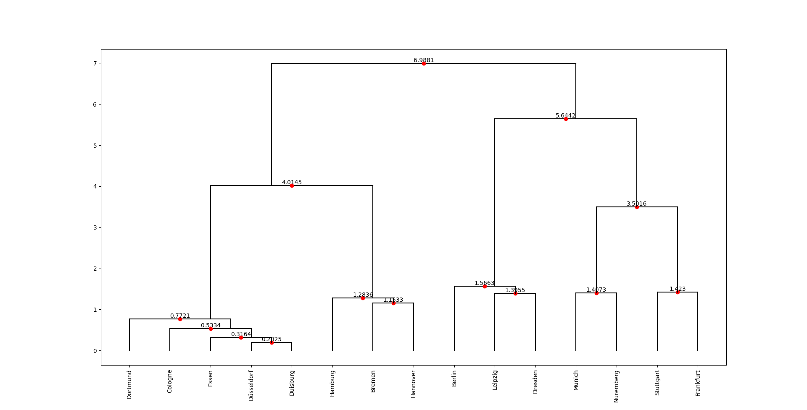

# Clustering

This project demonstrates (agglomerative) hierarchical clustering applied to city data of Germany and creates a dendrogram from the data. This type of clustering allows cities to be grouped by disimilarity, and for this specific purpose, I am using simply the latitude and longitude. The issue with this method is that it is relatively slow, which can be seen when running this code. There are obviously things that could be optimized, or using Python specific libraries such as [Scipy](https://docs.scipy.org/doc/scipy/reference/generated/scipy.cluster.hierarchy.dendrogram.html). However, I wanted to see how to do it all myself.



## Requirements

- Python 3
- [Numpy](https://numpy.org/)
- [Matplotlib](https://matplotlib.org/)

## Usage

Clone the repo or download it and unpack. The data is included in 

```
\data
```

cd into the directory and you can run the main file.
```
usage: main.py [-h] [-p POP_LIMIT] [-v VERBOSE] [-l LINKAGE]

Hierarchical Clustering of German Cities

options:
  -h, --help            show this help message and exit
  -p POP_LIMIT, --pop_limit POP_LIMIT
                        Population limit for clustering
  -v VERBOSE, --verbose VERBOSE
                        Print debugging info while running
  -l LINKAGE, --linkage LINKAGE
                        The type of linkage to be used - complete : complete linkage - single : single linkage - average : average linkage
```

## File Structure

- `data_gen.py`: File to generate the data from the CSV file.
- `distance.py`: Helper file for cartesian distance calculations
- `hierarchical.py`: File to run the hierarchical clustering
- `linkage.py`: Helper file for different types of linkage
- `plotting.py`: File to create the dendrogram
